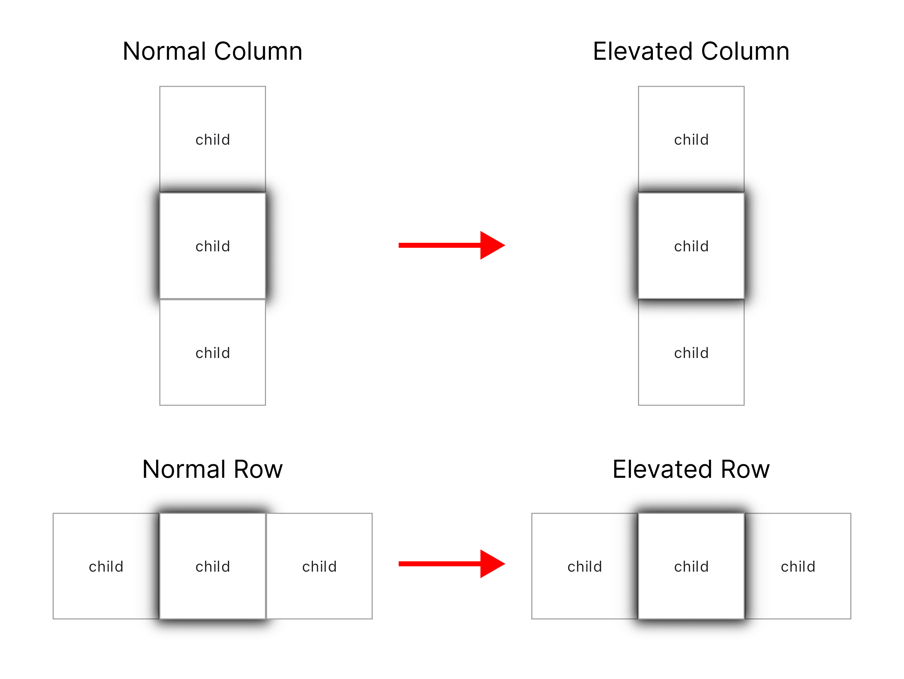

## About

`elevated_flex` is a package that allows you to build columns and rows within which you can elevate some children above the rest. At the same time, without violating their order and content adaptability.



## ElevatedColumn

`ElevatedColumn` is built exactly like a regular `Column`, and accepts all the same parameters. All you need is to wrap one or several of the children in an `Elevated` widget:

```dart
ElevatedColumn(
  mainAxisSize: MainAxisSize.min,
  children: [
    SimpleChild(),
    Elevated(child: SimpleChild(shadow: true)),
    SimpleChild(),
  ],
)
```

## ElevatedRow

`ElevatedRow` is built exactly like a regular `Row`, and accepts all the same parameters. All you need is to wrap one or several of the children in an `Elevated` widget:

```dart
ElevatedRow(
  crossAxisAlignment: CrossAxisAlignment.end,
  children: [
    SimpleChild(),
    Elevated(child: SimpleChild(shadow: true)),
    SimpleChild(),
  ],
)
```


## Flex params

The `ElevatedColumn` and `ElevatedRow` widgets accept all the same parameters as their standard prototypes:
- `mainAxisAlignment`
- `mainAxisSize`
- `crossAxisAlignment`
- `verticalDirection`.

Therefore, you can safely use it for replacement where necessary.

To test the behavior, I developed a special sandbox screen where you can compare the behavior of standard components and their Elevated analogues

example link

https://github.com/lukas-pierce/elevated_flex/assets/4938316/3b5b91f4-2f94-46a9-bda8-1afba238d8db


## TODO

The package does not currently support `CrossAxisAlignment.baseline`
